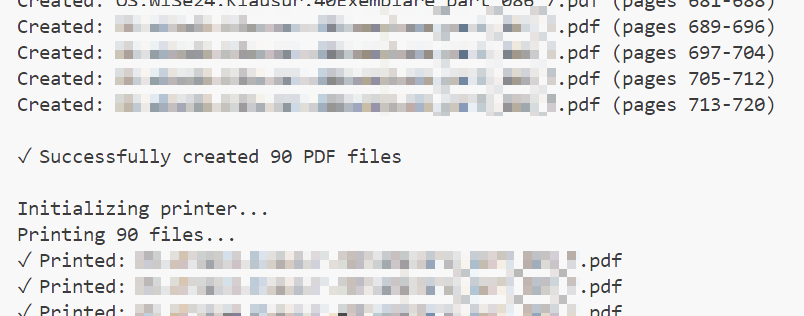

# Example Print Run 

## Prerequisites

- make sure you have installed the new printer drivers
- Make sure you are connected to the university VPN 

## Workflow

1. Check for the right printer to use 
   
    `python main.py --list-printers` to determine a list of available printers

    
  
2.  Print the file 

    ` python main.py .\MY_LARGE_EXAM_FILE.pdf --pages 8 --print --printer "\\THE_PRINTERNAME_FROM_ABOVE" --print-options "sides=two,finishings=staple-top-left"

    The programm should start splitting the files...

    
  
    Then initilizing the printer and sending the files... 

    

    And showing you a result on the end... 

    

