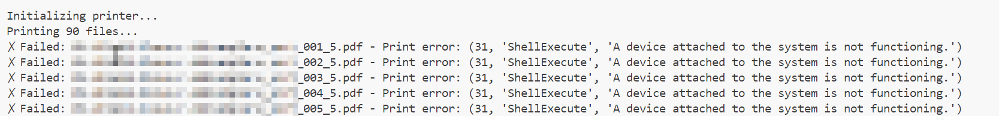

# Troubleshooting

## Error 31

In case you run into a Error 31 (A device attached to the system is not functioning.) please change the default  program used to display/print PDF files.

For me, Microsoft Edge was not be able to perform the printing commands, therefore, I switched to PDF Annotator. Any other PDF program might work as well. Please try out various tools. 

